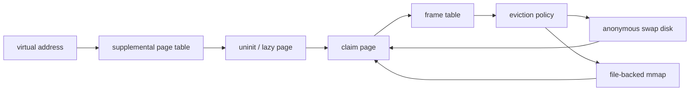

# Pintos Phase 2 — Virtual Memory

> A C-based virtual-memory implementation lab covering supplemental page tables, lazy loading, frame allocation, swap, eviction, stack growth, and memory-mapped files.

KAIST Pintos에서 virtual address부터 physical frame과 swap disk까지 이어지는 page lifecycle을 직접 구현하고 디버깅한 운영체제 팀 프로젝트입니다.

## Project continuity

팀 변경과 함께 이 저장소는 별도로 초기화되었습니다. 첫 저장소와 Git ancestry를 공유하지는 않지만, 같은 KAIST Pintos 과정에서 Threads와 User Programs 다음 단계인 Virtual Memory 구현을 이어갔습니다.

## What we implemented

| 영역 | 구현 범위 | 대표 근거 |
| --- | --- | --- |
| SPT·frame·lazy loading | page 메타데이터, frame table, lazy segment 초기화와 claim 경로 | [PR #85](https://github.com/whiskend/pintos_302_G1/pull/85), [#88](https://github.com/whiskend/pintos_302_G1/pull/88), [#90](https://github.com/whiskend/pintos_302_G1/pull/90) |
| Page fault와 rollback | fault 처리, claim 실패 시 frame/page 관계 복구 | [PR #84](https://github.com/whiskend/pintos_302_G1/pull/84), [#87](https://github.com/whiskend/pintos_302_G1/pull/87) |
| Anonymous swap·eviction | bitmap 기반 swap slot, disk I/O, victim frame 교체 | [PR #92](https://github.com/whiskend/pintos_302_G1/pull/92), [#96](https://github.com/whiskend/pintos_302_G1/pull/96) |
| Stack growth | syscall user buffer를 포함한 stack 확장 | [PR #95](https://github.com/whiskend/pintos_302_G1/pull/95) |
| mmap·munmap | file-backed page의 lazy mapping과 해제 | [PR #98](https://github.com/whiskend/pintos_302_G1/pull/98), [#100](https://github.com/whiskend/pintos_302_G1/pull/100) |
| SPT copy·resource lifetime | fork 시 page 복사, swapped page와 aux 정리 | [PR #99](https://github.com/whiskend/pintos_302_G1/pull/99), [#102](https://github.com/whiskend/pintos_302_G1/pull/102) |

## Page lifecycle architecture



- SPT는 page-aligned virtual address를 기준으로 각 프로세스의 page 상태를 찾습니다.
- claim은 frame 확보, page/frame 연결, page table mapping, `swap_in`을 하나의 복구 가능한 흐름으로 묶습니다.
- 물리 frame이 부족하면 victim을 고르고 anonymous page는 swap disk로, file-backed page는 파일 정책에 따라 내보냅니다.
- 프로세스 종료와 `munmap`에서는 aux, file, swap slot, frame 관계를 중복 해제하지 않도록 수명을 정리합니다.

## Fresh verification

당시 PR에 기록된 테스트와 현재 재현 명령은 [검증 문서](docs/portfolio/VERIFICATION.md)에 분리해 두었습니다.

## Run locally

Docker/Dev Container 환경에서 다음 명령으로 재현할 수 있습니다.

```bash
cd pintos
source ./activate
make -C vm check
```

특정 anonymous swap 사례만 실행하려면 다음 명령을 사용합니다.

```bash
make -C vm tests/vm/swap-anon.result
```

## License and attribution

이 저장소는 KAIST Pintos 교육용 코드베이스와 Stanford Pintos를 기반으로 합니다. 자세한 조건은 [`pintos/LICENSE`](pintos/LICENSE)를 확인하세요.
